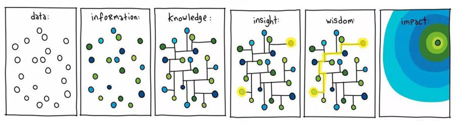
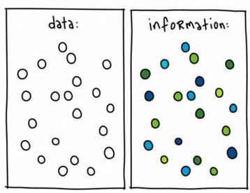
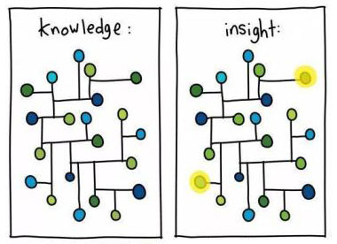
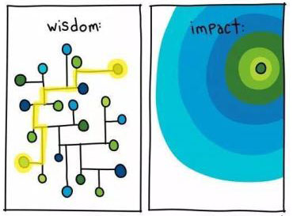

# 数字化转型：你的公司在什么阶段？

无论您是否认同，企业数字化是商业逐利的必然结果。
即使您没有使用任何的IT技术，您也使用财务记账来监控现金流、评估业绩和进行决策。
这就是数字化的雏形。

计算机的参与只是使得这个进程变得更加的实时。

既然如此，为何您的企业在数字化后会出现效果不及预期呢？
一方面，是因为企业管理者对该概念期待过高，认为一次开发就能成功。
另一方面， 因为IT系统功能更多，记录的数据也更多，使得系统更加复杂，
决策者处理不了那么多的数据，于是数据只能躺在那里了，
虽然提高了检索效率，但记录数据是需要时间的，因此也降低了效率。

因此，企业在进行数字化转型时，需要合理设定目标、认识到数字化转型是一个持续的过程，同时也需要关注数据的质量和有效利用，以确保数字化项目能够取得预期的效果。
**[试用码小螈开发平台](https://www.xiumasoft.cn)**，帮您快速分步实现数字化转型。

# 数字化阶段

既然数字化是分阶段的，那么如何分辨你们公司的数字化在哪种阶段？

## 纸质阶段

传统企业没有使用计算机记录的习惯，数据比较分散。
核心数据可能在员工手中，一旦离开员工，公司运作可能就不正常。
但是在员工离开前，管理者可能并不清楚情况。
一个著名的例子是销售带走客户，而公司没有记录下客户的任何信息。

## 数据记录阶段

特征是数据都往系统里面填写。这样就解决了数据不在企业的问题。

## 知识形成阶段

知识是通过关联数据形成的，通过系统数据关联和搜索，提高了员工处理问题的速度。
通常，这个阶段与数据记录阶段是同时实现的。因为现代系统没有不带搜索功能的。
**[与我们联系](https://www.xiumasoft.cn)**咨询模板，一键过渡到该过程。

## 洞察阶段

随着数据记录，有些级别不高的管理者可能会在日常的观察中，发现数据之间形成一种稀疏的关系。
然后，他们可能会记录下来，形成他们自己的知识，
但是这并不会成为公司的经验，只是因为他们存在所以效率得到提升。
企业可以用奖金鼓励员工分享经验，让它成为公司的经验。
于是，IT系统就需要为这些知识，更新换代了。

这通常需要与产品、IT技术进行沟通、排期、开发等一系列过程，这通常又是一个漫长的过程。
如果IT团队是外包的，还会因为不熟悉业务而产生大量的沟通时间。
使用**[码小螈开发平台](https://www.xiumasoft.cn)**，可大部分解决您这种问题。
它的无代码、低代码部分，使得简单程序可以不需要IT参与就能出成果。

## 智慧阶段

智慧是在洞察力的基础上形成的高层次的认知和智慧。
智慧不仅包括对数据和信息的理解，还包括对复杂问题的综合思考、创新性的见解和长期的智慧。
智慧有助于企业制定长远战略、预测未来趋势和做出具有颠覆性的决策。
说人话就是开始拥有包括AI助手在内的智能应用，帮您分析数据。

## 影响阶段

计算机里面的数据无时无刻对现实产生影响。各种自动化工具解放了工人的重复劳动。
数据形成各种报表、智能体提供分析建议，助力企业管理者判断当下形势和做出决策。
富不过三代成为过去式。

**[码小螈开发平台](https://www.xiumasoft.cn)**拥有超强的扩展能力，
可以对上面的各种阶段进行对接。从而助您一步步实现企业数字化。
不要被淘汰在数字化的浪潮中，抓住机遇，赢得成功！码小螈，与您共创辉煌未来！

